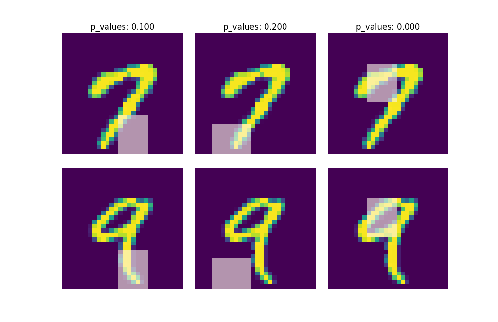

.. dnn-inference documentation master file, created by
   sphinx-quickstart on Sat Aug  1 19:39:41 2020.
   You can adapt this file completely to your liking, but it should at least
   contain the root `toctree` directive.
.. -*- mode: rst -*-

Welcome to Dnn-Inference's documentation!
=========================================
|PyPi|_ |Keras|_ |MIT| |Python3| |tensorflow|_ |downloads|_ |downloads_month|_

.. |PyPi| image:: https://badge.fury.io/py/dnn-inference.svg
.. _PyPi: https://badge.fury.io/py/dnn-inference

.. |Keras| image:: https://img.shields.io/badge/keras-tf.keras-red.svg
.. _Keras: https://keras.io/

.. |MIT| image:: https://img.shields.io/pypi/l/varsvm.svg

.. |Python3| image:: https://img.shields.io/badge/python-3-green.svg
	
.. |tensorflow| image:: https://img.shields.io/badge/keras-tensorflow-blue.svg
.. _tensorflow: https://www.tensorflow.org/

.. |downloads| image:: https://pepy.tech/badge/dnn-inference
.. _downloads: https://pepy.tech/project/dnn-inference
.. |downloads_month| image:: https://pepy.tech/badge/dnn-inference/month
.. _downloads_month: https://pepy.tech/project/dnn-inference

Dnn-Inference
=============

Dnn-Inference is a Python module for hypothesis testing based on deep neural networks.

This project was created by `Ben Dai <https://www.bendai.org/>`_. If there is any question and suggestion please contact me via <bdai@umn.edu>.

.. toctree::
    :maxdepth: 2

    README

Reference manual
================

.. toctree::
    :maxdepth: 2

    python-api/Dnn

.. Indices and tables
.. ==================

.. * :ref:`genindex`
.. * :ref:`modindex`
.. * :ref:`search`
